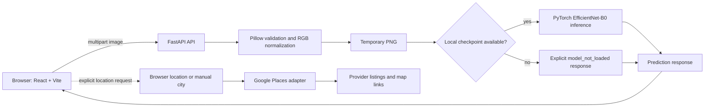

# SkinScope AI

SkinScope AI is an educational and research-oriented web application for uploading or capturing a skin-condition image and obtaining a model classification when a compatible local checkpoint is available. It is not a medical device and must not be used for diagnosis or treatment decisions.

## Overview

The project combines a React browser interface with a FastAPI service. The browser validates an image before upload; the API validates and normalizes it again, writes a temporary PNG, and passes that image to the inference boundary. When `backend/models/best_model.pth` is present and loadable, the backend returns the top prediction and alternatives. Without that local checkpoint, the API remains usable and explicitly returns `model_not_loaded` instead of fabricating a result.

The repository also contains dataset-preparation, training, evaluation, and inference infrastructure for an EfficientNet-B0 classifier. The checked-in model metadata describes four classes: Acne, Psoriasis, Rosacea, and Eczema. Dataset images, prepared splits, reports, and checkpoints are intentionally excluded from Git.

## Implemented features

- Drag-and-drop, file-picker, and browser camera image intake.
- Client and server validation for JPG/JPEG, PNG, and WEBP uploads up to 10 MB.
- Pillow decoding, MIME/content consistency checks, RGB normalization, dimension checks, and cleanup of temporary images.
- FastAPI `GET /health` and `POST /predict` endpoints with CORS configured from environment settings.
- Optional local PyTorch/EfficientNet-B0 checkpoint loading and top-k inference.
- Dataset preparation utilities that validate images, remove exact duplicates, create deterministic train/validation/test splits, and materialize ImageFolder-compatible folders.
- Pytest coverage for the API, dataset preparation, and training infrastructure.
- Explicit-consent browser/manual location search with a fail-closed Google Places (New) adapter.

## Final ML results

The balanced EfficientNet-B0 checkpoint was evaluated once on the untouched SCIN test split (223 images):

| Metric | Result |
| --- | ---: |
| Accuracy | 0.7220 |
| Macro precision | 0.6091 |
| Macro recall | 0.5647 |
| Macro F1 | 0.5762 |
| Weighted F1 | 0.7239 |

Per-class F1: Eczema 0.8385, Psoriasis 0.3143, Acne 0.5366, Rosacea 0.6154. These are research-prototype measurements, not clinical validation or diagnostic accuracy.

## Architecture



For the data and model-development flow, see [docs/architecture.md](docs/architecture.md) and [docs/training.md](docs/training.md).

The optional location flow never runs automatically and does not persist precise coordinates. `GET /dermatologists` uses the official Google Places API (New) Text Search endpoint only when the user requests it. Configure `GOOGLE_PLACES_API_KEY` with a restricted key, Places API (New), and billing enabled. Missing keys, invalid keys, quota errors, and provider outages fail closed without invented listings.

## Technology stack

- **Backend:** Python, FastAPI, Pydantic Settings, Pillow, Uvicorn
- **Model development:** PyTorch, Torchvision, NumPy, pandas, scikit-learn, Matplotlib
- **Frontend:** JavaScript, React, Vite, Tailwind CSS, Axios

No hardware, external database, cloud service, or authentication provider is implemented in this repository.

## Requirements

- Python 3.11 or newer
- Node.js 20 or newer for the frontend
- A compatible local model checkpoint at `backend/models/best_model.pth` only if live predictions are required

## Installation and usage

From the repository root, create the backend environment and start the API:

```powershell
python -m venv .venv
.venv\Scripts\Activate.ps1
python -m pip install -r backend\requirements.txt
Copy-Item .env.example .env
python -m uvicorn backend.main:app --host 127.0.0.1 --port 8000 --reload
```

In a second terminal, start the frontend:

```powershell
cd frontend
Copy-Item .env.example .env
npm install
npm run dev
```

Open `http://localhost:5173`. The API documentation is available at `http://127.0.0.1:8000/docs`.

### Configuration

The root `.env` supports `BACKEND_HOST`, `BACKEND_PORT`, `FRONTEND_URL`, and optional `GOOGLE_PLACES_API_KEY`; the frontend `.env` supports `VITE_API_URL`. Copy the provided example files and keep real `.env` files out of version control. The API key is never committed or logged.

### Model and data workflow

`backend/models/best_model.pth` is deliberately ignored. If it is absent, image intake remains functional but prediction returns `model_not_loaded`.

Dataset tooling uses `data/dataset_config.json` and `data/class_mapping.json`. The active source configuration is SCIN; the checked-in configuration marks its use as allowed and targets the four classes listed above. Run preparation only with data you are authorized to use:

```powershell
python -m pip install -r requirements-data.txt
python scripts\prepare_dataset.py
python scripts\inspect_dataset.py
python training\train.py
```

Training and data-use conditions are documented in [docs/dataset_strategy.md](docs/dataset_strategy.md), [docs/dataset_preparation.md](docs/dataset_preparation.md), and [docs/training.md](docs/training.md).

## Testing

Run the available automated checks from the repository root:

```powershell
python -m pytest backend\tests -q
python -m compileall backend training scripts
```

Build the frontend after installing its dependencies:

```powershell
cd frontend
npm run build
```

## Project structure

```text
backend/       FastAPI service, image validation, inference integration, and tests
frontend/      React/Vite browser interface
training/      Model configuration, training, evaluation, and inference utilities
scripts/       Dataset download, preparation, and inspection helpers
data/          Versioned configuration plus ignored source/prepared data locations
docs/          Dataset, training, and architecture documentation
reports/       Ignored generated evaluation outputs
```

## Limitations and status

- This is an educational/research prototype, not a diagnostic service.
- Live results depend on an unversioned, local checkpoint; no model file is distributed with the repository.
- The repository does not include a public dataset, training report, measured accuracy, or clinical validation evidence.
- The four-class model has limited minority-class performance; Psoriasis F1 is 0.3143 on the held-out test split.
- Uploaded images are temporarily processed by the server; this is not a persistent patient-record system.
- Camera availability depends on browser permissions and a secure context such as localhost or HTTPS.
- Live dermatologist search remains disabled until an authorized Google Places API key is configured.

Future work may include reproducible release artifacts for an authorized model, documented evaluation results, and expanded validation only after appropriate dataset and clinical-review processes.

## Privacy and medical safety

Predictions are AI outputs from a research prototype and are not medical diagnoses. Users should seek qualified professional evaluation, especially for changing, painful, bleeding, or concerning lesions. Uploaded images are validated and processed through a temporary file that is removed after inference. Location is requested only after an explicit action, is sent only for that search, and is not stored by this application. Dermatologist names, addresses, ratings, phone numbers, and navigation links are displayed only when returned by Google Places; the application does not scrape or invent provider data.

## License

The source code is released under the [MIT License](LICENSE). This license does not grant rights to external datasets, model weights, or medical imagery; obtain and follow their respective terms independently.

## Author

Git author configuration in this repository identifies [Danish3344](https://github.com/Danish3344).
