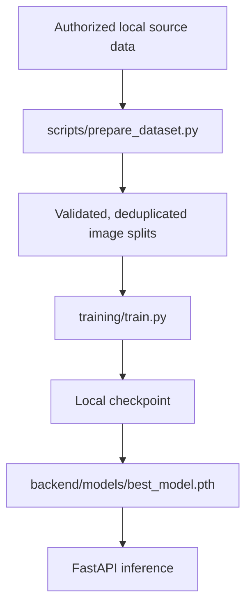

# Architecture

## Runtime request flow

1. The React/Vite frontend accepts an image through file selection, drag-and-drop, or browser camera capture.
2. The frontend sends the image as multipart form data to `POST /predict`.
3. FastAPI checks the declared MIME type and file size, then Pillow verifies that the bytes form a matching, supported image.
4. The image is normalized to RGB, written to a temporary PNG, and passed to `backend.ml.inference`.
5. `ModelService` loads `backend/models/best_model.pth` once when that checkpoint is available. It returns `model_not_loaded` when no loadable checkpoint exists.
6. With a loaded checkpoint, the service calls the training inference utility and returns the primary prediction, alternatives, disease information, and an educational/research disclaimer.
7. The temporary file and Pillow image are cleaned up before the request completes.

## Development flow

Data, generated reports, and checkpoints are ignored by Git. Their presence in a local working copy must not be interpreted as permission to redistribute them.
